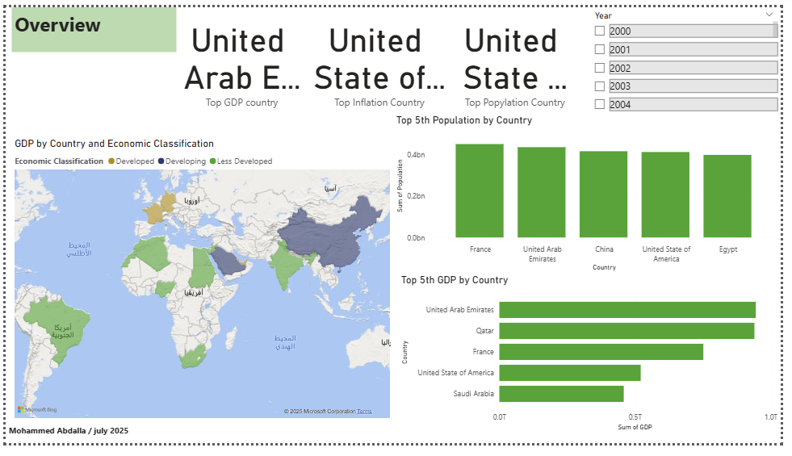

# Power-BI-project-2
# 🌍 Economic Indicators Dashboard – Power BI Project

## 📅 Date: July 2025  
👤 Developed by: Mohammed Abdalla

---

## 📌 Overview

This interactive Power BI dashboard provides comprehensive insights into key economic indicators across selected countries from the year 2000 to 2025. The project aims to visualize global economic trends such as GDP growth, inflation, population dynamics, and demographic structure.

---

## 📊 Key Insights

- Top GDP Country: 🇦🇪 United Arab Emirates  
- Top Inflation Country: 🇺🇸 United States of America  
- Top Population Country: 🇺🇸 United States of America  

- 🔝 Top 5 Countries by GDP include three Arab countries:
  1. United Arab Emirates  
  2. Qatar  
  3. Saudi Arabia  

- 📈 A positive correlation is observed between GDP per Capita and Population by country – indicating that countries with larger populations tend to also exhibit higher GDP per capita in this dataset.

---

## 📈 Dashboard Highlights

- GDP and Population Growth (2000–2025)  
- GDP per Capita vs. Population by Country  
- Inflation Rate Trends by Year  
- Age Group Demographics:
  - 0–14 years
  - 15–64 years
  - 65+ years

- Economic Classification:
  - Developed  
  - Developing  
  - Less Developed

---

## 🔍 Technical Features

- 📅 Dynamic Year Filter (Default view is 2025)  
- 🌐 Country Selection Slicer  
- 📊 Custom Visuals:
  - Bar Charts
  - Line Charts
  - 100% Stacked Bars
- 🧮 KPIs:
  - Total GDP  
  - Average GDP per Capita  
  - Inflation Rate (%)  
  - Unemployment Rate (%)  
  - Total Population  

---

## 🛠 Tools Used

- [Power BI Desktop](https://powerbi.microsoft.com/)
- Custom DAX Measures
- Integrated multi-year economic dataset
- Clean and responsive dashboard layout

---

## 📋 Sample Summary Table

| Country | Total GDP | GDP/Capita | Inflation (%) | Population | Unemployment (%) |
|---------|-----------|------------|----------------|------------|------------------|
| UAE     | 907.3B    | ~60,000    | 2.3            | ~9M        | 3.5              |

---

## 📷 Screenshots

#Report preview
#Overview page

Mohammed Abdalla
📍 UAE
📧 alvin98.mo@gmail.com
🔗 LinkedIn Profile (Add your LinkedIn URL)

⸻

📌 Notes
 • Data shown is simulated or extracted for academic and portfolio purposes.
 • This project is part of a professional portfolio to demonstrate skills in Power BI dashboarding and economic data analysis.
